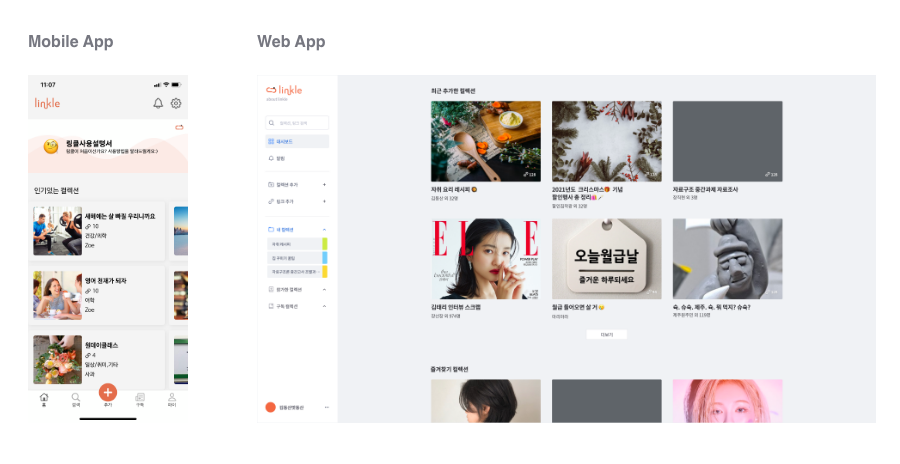
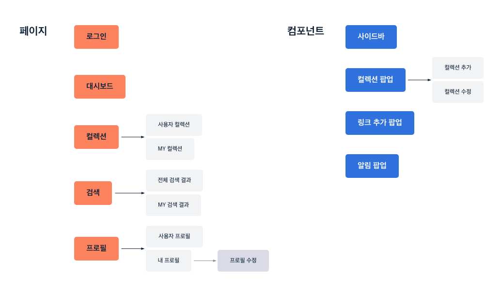
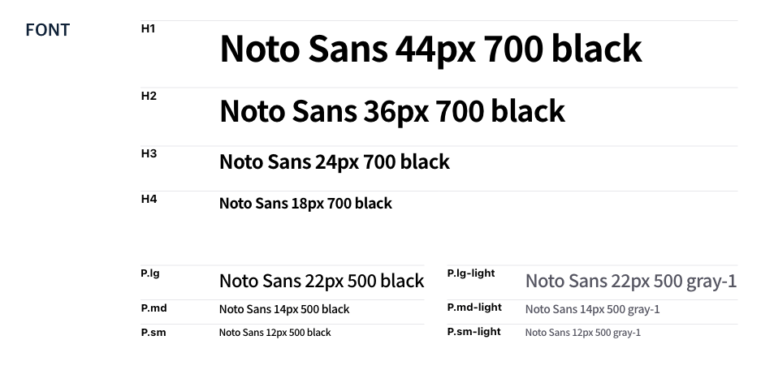
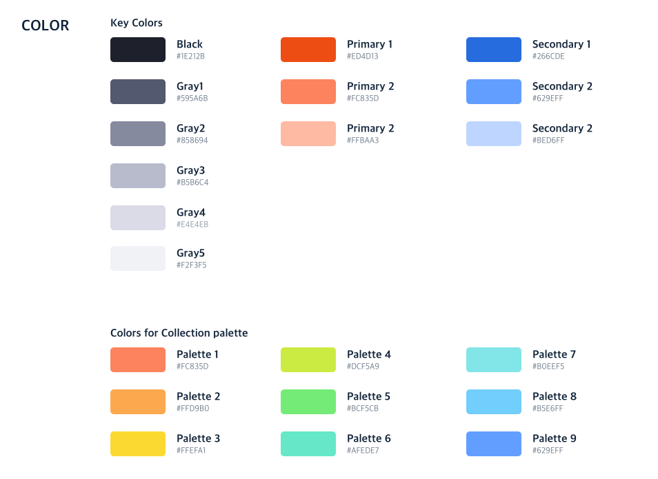
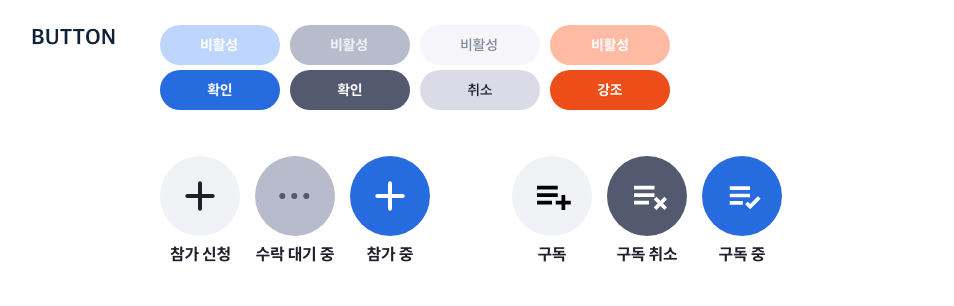
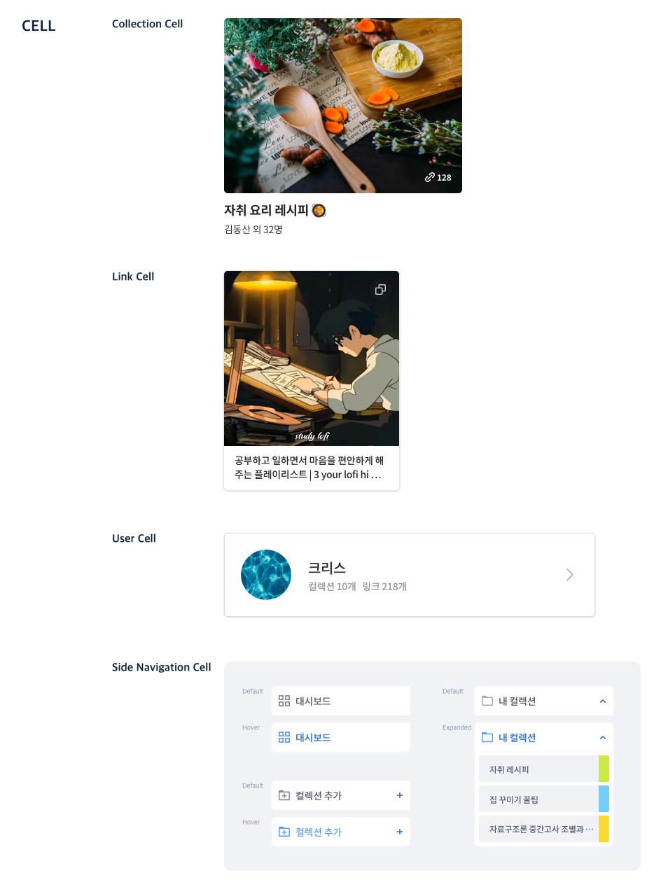

# 링클 Linkle

링클은 링크를 저장하고, 분류하고, 공유할 수 있는 서비스입니다.
이미 모바일 애플리케이션으로 출시된 링클은, 2022년 웹 애플리케이션으로도 확장될 예정입니다.

## 웹 애플리케이션 구조
---
링클은 [사용자 요구사항](https://dev-mari.notion.site/532aaed9183f406cadae1255c12dae7f)을 작성 후, 이를 기반으로 페이지와 컴포넌트를 정의하였습니다. 도식화한 모습은 다음과 같습니다.

이후, 정의된 화면과 컴포넌트의 [Wireframe](https://dev-mari.notion.site/833f551e886d45248b19fd83b751e251)을 제작하였습니다.

## 디자인 가이드
---
어플리케이션 내에서 공통적으로 사용될 서체, 색상, 버튼, 셀 등의 디자인 요소를 정리하였습니다.

## MVC 아키텍쳐 적용
---
##### 2022.02 
- MVC Pattern에 따라 코드 리팩토링 시작